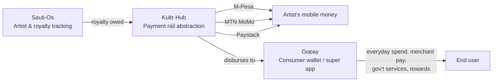

# The East Africa Fintech & Creator-Economy Thesis

**How Gopay, Sauti-Os, and Kultr-Hub form one connected bet — and why that connection wasn't documented anywhere until now.**

---

## The core insight

Three CREOVA repos, built separately, solve three layers of the same problem: **getting money to move reliably for people and creators in East African markets, where the payment rails are fragmented across mobile money providers and the music/creator economy has no real royalty infrastructure.**

| Layer | Repo | What it does |
|---|---|---|
| **Infrastructure** | [`Kultr-Hub`](https://github.com/creova-gif/Kultr-Hub) | Unified payments abstraction — M-Pesa (Kenya), MTN Mobile Money (multi-market East/West Africa), Paystack (Nigeria/Ghana card payments), plus FX conversion between them |
| **Creator tooling** | [`Sauti-Os`](https://github.com/creova-gif/Sauti-Os) | Artist and royalty management — airplay tracking, contracts, royalty calculation, event bookings, song catalog |
| **Consumer distribution** | [`Gopay`](https://github.com/creova-gif/Gopay) | Swahili-first fintech super app — payments, merchant tools, government services, rewards, offline USSD fallback |

Stacked, this reads as a real thesis: **Sauti-Os tracks what an artist is owed → Kultr-Hub is the rail that actually moves the money across whichever mobile-money system the artist uses → Gopay is the consumer-facing wallet where that money (and everything else) lands.** That's not three unrelated products. That's vertical infrastructure for a specific, underserved market — royalty administration in African music markets is currently manual or nonexistent, and mobile-money fragmentation is a real, well-documented pain point for anyone moving money across Kenya, Tanzania, Nigeria, and Ghana simultaneously.

---

## What's real right now, and what isn't

Being precise about this matters more than the pitch:

- **Confirmed:** all three repos exist, are independently functional, and were built with clean security practices (no leaked credentials found in any of them across a full history audit).
- **Not confirmed:** no code-level integration currently exists between the three. Sauti-Os doesn't currently call Kultr-Hub's API. Gopay doesn't currently reference either. This thesis is currently **conceptual** — a real strategic asset, not yet a real technical one.

That gap is the actual opportunity. The hard parts (payment rail integration, royalty logic, consumer distribution UX) are each already built. What's missing is the connective tissue.

---

## Why this is worth formalizing

1. **Differentiation.** "Fintech app" and "royalty tracker" are crowded categories individually. "Vertically integrated payment infrastructure for the African creator economy" is not — and it's a more defensible, harder-to-replicate position because it requires three separate hard problems solved together, not one.
2. **Sequencing.** If this is the real direction, it changes near-term priorities: Kultr-Hub's payout API becomes something Sauti-Os should consume, not just a standalone tool. That's a concrete next engineering task, not just a narrative.
3. **Fundraising/pitch clarity.** A GoPay-only pitch is a fintech app in a competitive category. A GoPay + Sauti-Os + Kultr-Hub pitch is infrastructure for a market (African creator economies) that most fintech products ignore entirely — a materially different and more interesting story to an investor, if it's real.

---

## Recommended next steps

- [ ] Confirm this is the intended direction (this document assumes it is, based on how the three products actually work — worth an explicit yes/no)
- [ ] If yes: scope the actual integration — Sauti-Os → Kultr-Hub payout API is the smallest, highest-leverage first connection
- [ ] Add a short cross-reference section to each of the three repos' READMEs (done — see below)
- [ ] Consider whether this thesis belongs in pitch materials, not just this repo

---

## Where this is referenced

- [`CREOVA`](https://github.com/creova-gif/CREOVA) — top-level ecosystem note
- [`Gopay`](https://github.com/creova-gif/Gopay) README — roadmap section
- [`Sauti-Os`](https://github.com/creova-gif/Sauti-Os) README — roadmap section
- [`Kultr-Hub`](https://github.com/creova-gif/Kultr-Hub) README — roadmap section

*This document lives in the `CREOVA` repo as the canonical version. If it's copied elsewhere, treat this copy as the source of truth.*
